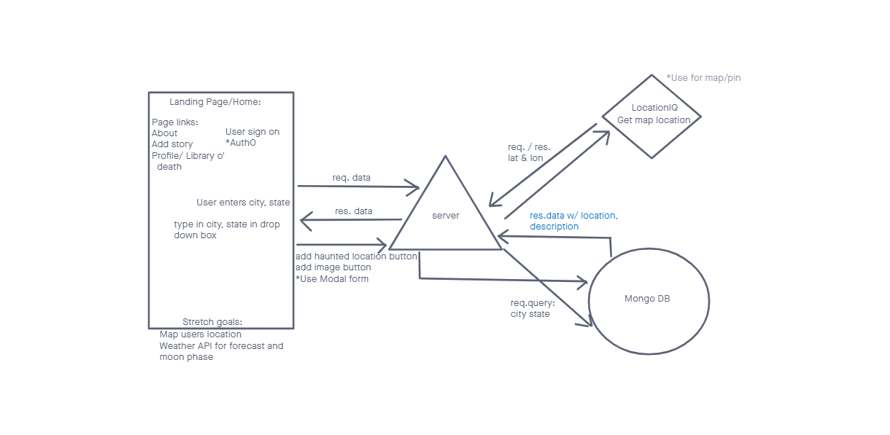
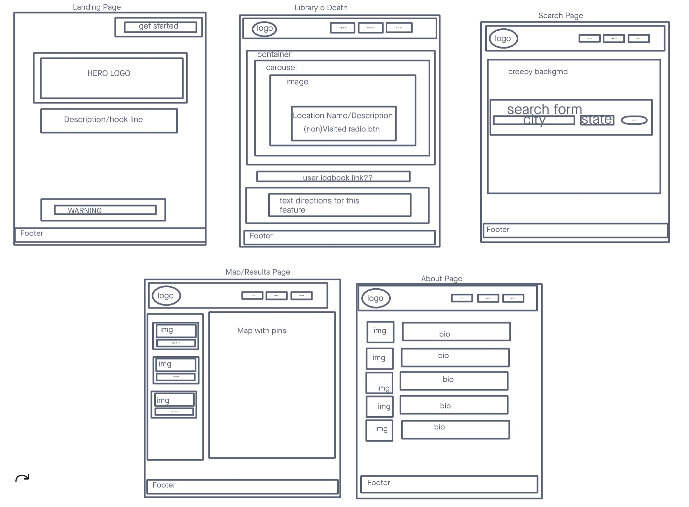

# Inspectre

https://in-spectre.netlify.app/

## Description

Searching for a fright? Inspectre is an application that lets users search for haunted locations of interest near them. Locations will contain backstories, reviews of the location, and pictures.

## Usage

1. Press Login at top left of the In{spectre} home screen
2. Once signed in, click "Find Haunts" (Library of Death will be empty)
3. Type in the city and state where you want to search for haunted locations
4. Select 'Submit'
5. Select locations you want to save by clicking "Add to Library of Death"
6. Vote for locations you've visited (ghost or no-ghost icons) 
7. Happy Hunting!

## Data Flow

<a href = 'https://trello.com/b/RzdRKIEg/inspectre-project-board'>User Stories</a>

## Design Wireframe

## Team:

- Andrew Kim
- Brannon Starnes
- Min Xie
- Raaj Vardhan
- Scott Lease

## Credits

- Glitch Animation CSS Walkthrough and Code: https://codepen.io/mattgrosswork/pen/VwprebG
- Prefers Reduced Motion: https://web.dev/prefers-reduced-motion/#(bonus)-forcing-reduced-motion-on-all-websites
- Haunted Location Data: https://data.world/timothyrenner/haunted-places
